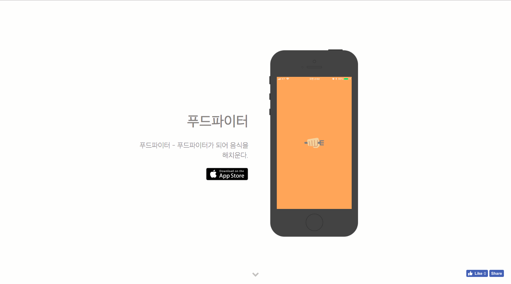
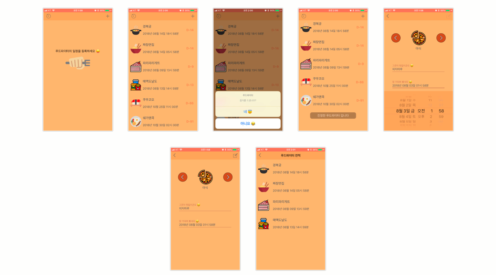

# FoodFighter
음식을 정복한다 😃  
> 먹을 일정을 기록하고 먹었던 일정은 기록된다.

## develop
- Language: Swift4
- Tool: Xcode, Realm
- library: RealmSwift

### Result
로컬 데이터 DB선택을 Realm으로 정함
Realm은 빠르고 디비 설계가 간편함

### Example
main model DB example
```
class MainList : Object {
    @objc dynamic var title : String = ""
    @objc dynamic var descript : String = ""
    @objc dynamic var image : Int = 0
    @objc dynamic var done : Bool = false
    @objc dynamic var createdTime : Date? 
}
```

## App Store
<a href="https://itunes.apple.com/us/app/%ED%91%B8%EB%93%9C%ED%8C%8C%EC%9D%B4%ED%84%B0/id1419747262?mt=8"></a>

### screen


