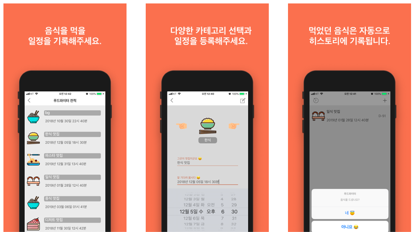

# 푸드파이터
음식을 정복한다 😃  
> 먹을 일정들을 기록하고 먹었던 일정은 자동으로 기록된다.

## 개발
- Language: Swift
- Tool: Xcode
- library: RealmSwift, RevealingSplashView

### Realm을 선택한 이유
개인 프로젝트 ‘SEEFOOD’<https://github.com/kimhyeri/SeeFood>를 통해 SQLite, Realm , Coredata, UserDefault와 
같은 로컬 데이터베이스들의 특징을 파악한 후 다방면에서 이점이 있다고 생각된 Realm을 푸드파이터 로컬 데이터베이스로 선택함. 

### 결과
로컬 데이터 DB선택을 Realm으로 정함.  
Realm은 빠르고 디비 설계가 간편함.

### Architecture
MVC (Model - View - Controller)

### Example DB
> main model DB example
  
```
class MainList : Object {
    @objc dynamic var title : String = ""
    @objc dynamic var descript : String = ""
    @objc dynamic var image : Int = 0
    @objc dynamic var done : Bool = false
    @objc dynamic var createdTime : Date? 
}
```

## 앱 스토어
<a href="https://itunes.apple.com/us/app/%ED%91%B8%EB%93%9C%ED%8C%8C%EC%9D%B4%ED%84%B0/id1419747262?mt=8"></a>

### 📸

